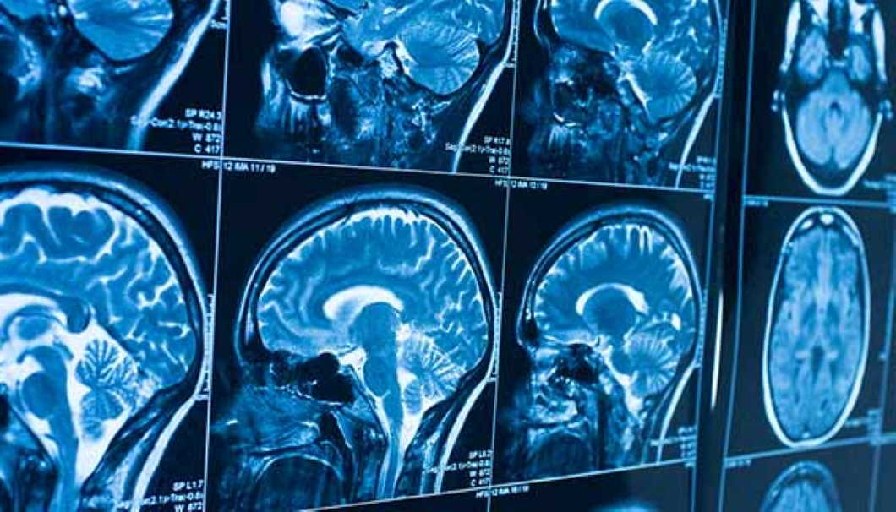

[](https://www.map.org.uk)

# 🧠 Brain Tumor Detection using CNN



> A Convolutional Neural Network (CNN) to detect brain tumors from MRI images.

## Overview

This project demonstrates how to build, train, and evaluate a CNN model using TensorFlow/Keras to classify whether an MRI image of the brain contains a tumor or not. The dataset consists of labeled MRI scans categorized into two classes: **tumor present** and **no tumor**.

---

## 🔍 Project Overview

This deep learning model helps in detecting brain tumors from MRI images with high accuracy. It is trained on a real-world dataset containing both positive (tumor) and negative (no tumor) cases.

- ✅ Uses **Convolutional Neural Networks**
- 📊 Trained on **253 MRI images** (155 tumor, 98 no-tumor)
- 🧪 Achieves high **test accuracy**, precision, recall, and AUC score
- 📈 Includes training/validation loss and accuracy curves
- 📊 ROC Curve visualization and classification report

---

## 📁 Dataset Used

🔗 [Brain Tumor MRI Images Dataset](https://www.kaggle.com/navoneel/brain-mri-images-for-brain-tumor-detection)

Folder Structure:
```
brain_tumor_dataset/
├── yes/     # Tumor images
└── no/      # No tumor images
```

The dataset contains:
- `155` images of brains with tumors
- `98` images of brains without tumors

---

## 🛠️ Technologies Used

- Python
- TensorFlow / Keras
- NumPy
- OpenCV
- Matplotlib & Seaborn
- Scikit-learn (for metrics)
- ImageDataGenerator (for data augmentation)

---

## 🧠 Model Architecture

```python
model = Sequential([
    Conv2D(128, (5,5), activation='relu', input_shape=(64, 64, 3)),
    MaxPooling2D(2,2),

    Conv2D(128, (5,5), activation='relu'),
    MaxPooling2D(2,2),

    Conv2D(128, (5,5), activation='relu'),
    MaxPooling2D(2,2),

    Conv2D(32, (3,3), activation='relu'),
    MaxPooling2D(2,2),

    Flatten(),

    Dense(128, activation='relu'),
    Dense(128, activation='relu'),
    Dense(1, activation='sigmoid')  # Binary classification
])
```

Compiled with:
- Optimizer: `Adam` with exponential decay learning rate
- Loss function: `binary_crossentropy`
- Metric: `accuracy`

---

## 🏃‍♂️ How to Run

### 🔽 Clone the repo

```bash
git clone https://github.com/Abdallah-707/Brain-Tumor-Detection-CNN.git
cd Brain-Tumor-Detection-CNN
```

### ⚙️ Install dependencies

```bash
pip install numpy matplotlib tensorflow opencv-python scikit-learn pillow
```

### 📂 Prepare the dataset

1. Download the dataset from Kaggle.
2. Place it as follows:
```
project_folder/
├── brain_tumor_dataset/
│   ├── yes/
│   └── no/
```

3. Upload and run the Jupyter Notebook or Python script.

---

## 📊 Training Summary

| Epochs | Train Acc | Val Acc | Test Acc |
|--------|-----------|---------|----------|
| 200    | ~99%      | ~97%    | ~97%     |

Model performance is visualized with:
- Training vs Validation Accuracy
- Training vs Validation Loss
- ROC Curve (Train vs Test)
- Classification Report (Precision, Recall, F1-score)

---

## 📷 Sample Prediction

You can use this model to predict brain tumor presence in new MRI images:

```python
img = cv2.imread("new_mri_image.jpg")
prediction = model.predict(img)
if prediction > 0.5:
    print("Tumor Detected!")
else:
    print("No Tumor Found.")
```

---

## 📋 Requirements File

To generate a requirements file:

```bash
pip freeze > requirements.txt
```

Or use this list:

```txt
numpy
matplotlib
tensorflow
opencv-python
scikit-learn
pillow
```

---

## 📦 Model Saving

After training, the model is saved in `.h5` format:

```bash
TumorPredictionCNN_model.h5
```

You can load it later using:

```python
from tensorflow.keras.models import load_model
model = load_model("TumorPredictionCNN_model.h5")
```

---

## 🚀 Future Enhancements

- Add support for DICOM file inputs
- Use more advanced architectures like ResNet, VGG16
- Implement Grad-CAM for better interpretability
- Build a web interface using Streamlit or Flask

---

## 📄 License

MIT License – see [LICENSE](LICENSE)
